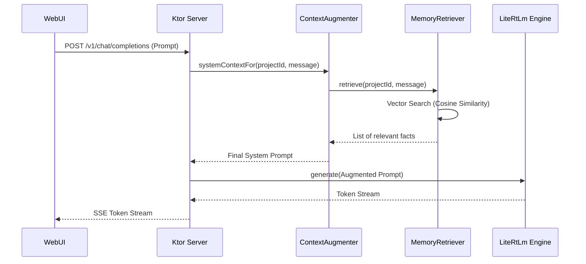

# MobileGem: On-Device LLM & Memory System Report

This report provides a comprehensive overview of the **MobileGem** codebase, an Android application designed to run Large Language Models (specifically Gemma) fully on-device with an advanced local RAG (Retrieval-Augmented Generation) memory subsystem.

## 1. System Architecture Overview

MobileGem is built as a hybrid application. It uses a native Android (Kotlin/Compose) shell for configuration and management, while the chat interface is a Vite-powered WebUI. These two worlds communicate via a local HTTP server running on the device.

### 1.1 High-Level Architecture Diagram

```mermaid
graph TD
    subgraph "Android App (Kotlin)"
        A[MainActivity & Compose UI] --> B[AppContainer]
        B --> C[LocalLlmServer (Ktor)]
        B --> D[InferenceController]
        B --> E[MemoryRepository]
        
        C --> F[ChatCompletionHandler]
        F --> G[ContextAugmenter]
        F --> D
        
        G --> H[MemoryRetriever]
        G --> I[SkillRepository]
        
        H --> J[LongTermMemoryRepository]
        J --> K[(Room Database)]
        
        D --> L[LiteRtLmTextGenerator]
        D --> M[MediaPipeTextEmbedder]
    end
    
    subgraph "WebUI (Vite/TS)"
        N[Chat Interface] <--> C
    end
    
    L -- "Gemma Model" --> O[On-Device NPU/GPU/CPU]
    M -- "TFLite Embedder" --> O
```

---

## 2. Core Subsystems

### 2.1 Inference Engine (LiteRT-LM)
The application uses the `com.google.ai.edge.litertlm` library, which is the specialized framework for running LLMs on mobile.

*   **Class:** `LiteRtLmTextGenerator`
*   **Capabilities:**
    *   **Backend Support:** Dynamically switches between **CPU** and **GPU** (NPU support is available in the library but configured via GPU/CPU in this app).
    *   **Streaming:** Uses Kotlin `Flow` to stream tokens back to the caller in real-time.
    *   **Lifecycle:** Managed by `InferenceController` which handles model initialization and hardware acceleration setup.

**Key Code Snippet (Inference Initialization):**
```kotlin
val engineConfig = EngineConfig(
    modelPath = modelPath,
    backend = if (useGpu) Backend.GPU() else Backend.CPU(),
    cacheDir = cacheDir.absolutePath
)
val engine = Engine(engineConfig)
engine.initialize() // Can take several seconds
```

### 2.2 Memory & RAG Subsystem
This is the "Superpower" of MobileGem. It implements a local version of Retrieval-Augmented Generation.

#### Long-Term Memory (LTM)
*   **Storage:** Room Database stores `MemoryEntry` objects which include a `FloatArray` embedding.
*   **Retrieval:** `MemoryRetriever` uses **Cosine Similarity** to find relevant memories based on the user's current message.

#### Self-Learning
*   **Class:** `SelfLearningExtractor`
*   **Logic:** When a session ends, the app sends the transcript back to the LLM with a specialized prompt to extract "durable facts." These facts are then embedded and stored in the LTM.

**Self-Learning Prompt:**
```text
Read the following conversation and extract durable, factual things 
worth remembering about the user or project... 
Respond with ONLY a JSON array of short fact strings.
```

### 2.3 Embedded API Server (Ktor)
To provide a seamless interface for the WebUI and potential external tools, the app hosts an **OpenAI-compatible server**.

*   **Endpoints:**
    *   `GET /v1/models`: Returns the currently loaded model.
    *   `POST /v1/chat/completions`: Handles chat requests (streaming and non-streaming).
*   **Port:** Default `8765` on `127.0.0.1`.

---

## 3. Library & Technology Stack

| Category | Library | Purpose |
| :--- | :--- | :--- |
| **LLM Inference** | `com.google.ai.edge.litertlm` | On-device Gemma inference. |
| **Embeddings** | `com.google.mediapipe:tasks-text` | Semantic vector generation. |
| **Server** | `io.ktor:ktor-server-cio` | Local OpenAI-compatible API. |
| **Database** | `androidx.room` | Persistent storage for history and memory. |
| **UI** | `Jetpack Compose` | Native Android UI shell. |
| **Web UI** | `Vite / TypeScript / Lit` | Advanced chat interface bundled in assets. |
| **Async** | `Kotlin Coroutines` | Non-blocking execution of inference and server tasks. |

---

## 4. Sequence Diagram: Augmented Chat Flow

This diagram illustrates how a message from the user is augmented with local memory before being sent to the LLM.



---

## 5. Design Opinions & Enhancements

### 5.1 Observations
*   **Clean Separation of Concerns:** The use of an internal API server is a brilliant architectural choice. It decouples the UI from the complex native LLM bridge, allowing the WebUI to be developed and tested independently.
*   **Resource Management:** The app carefully manages the heavy LiteRT-LM engine, using a `Closeable` pattern to ensure GPU resources are released when switching models.
*   **Brute-Force Search:** The current `MemoryRetriever` performs an in-memory brute-force search over all project memories. While fine for hundreds of entries, it will scale poorly to thousands.

### 5.2 Recommended Enhancements

1.  **Vector Index Optimization:** 
    *   Integrate a small native Vector DB (like **SQLite-VSS** or a lightweight HNSW implementation) to handle semantic search directly in the database layer. This would avoid loading all embeddings into memory.
2.  **Hybrid Search:**
    *   Combine vector search with **Keyword Search (BM25/FTS5)**. Sometimes exact matches (like names or specific IDs) are more important than semantic similarity.
3.  **Advanced Self-Learning Triggers:**
    *   Currently, self-learning happens at the end of a session. Adding "Active Learning" where the model can explicitly flag a fact to be remembered *during* the conversation would improve responsiveness.
4.  **Multi-Modal Support:**
    *   LiteRT-LM supports vision and audio. Extending the `InferenceController` to handle `Content.Image` or `Content.Audio` would turn MobileGem into a true multi-modal personal assistant.
5.  **Token Budget Management:**
    *   Add a tokenizer utility to calculate the current context window usage. If the augmented context (History + Memories + Skills) exceeds the model's limit (e.g., 8192 tokens for Gemma), the app should implement an intelligent pruning or summarization strategy.
6.  **Background Processing:**
    *   Ensure the `SelfLearningExtractor` runs in a `WorkManager` task or a low-priority background thread to prevent UI stutter during fact extraction after a long session.

---
**Report generated for:** Gemini CLI Engineering Team
**Date:** May 26, 2026
